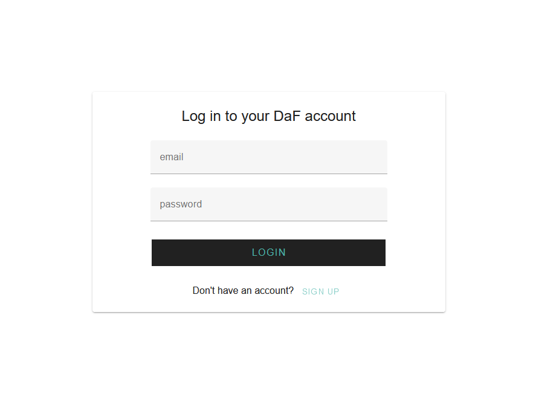
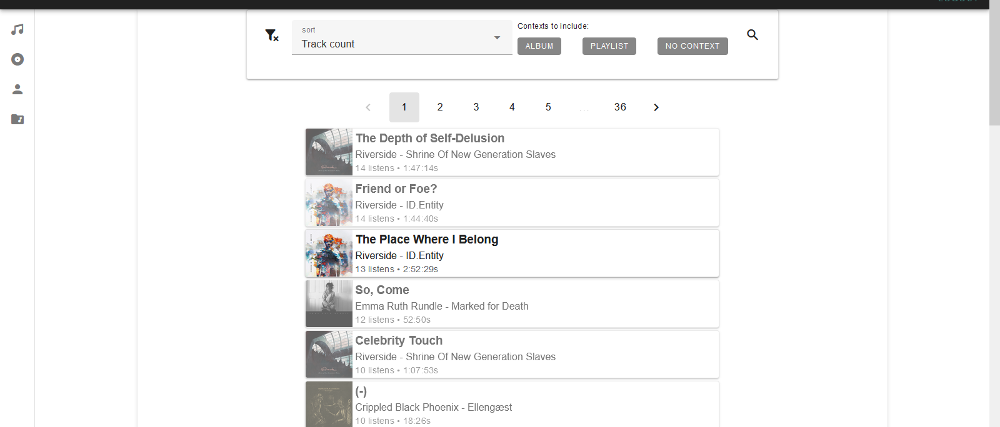

# DaF Reports

DaF Reports makes use of Spotify to allow users to track their listening history and perform analysis.

The live application can be found at http://dafreports.us/ (For now, it will redirect to a amazon webservice app runner url)



## Creating a User

In order to create a user, signing up for a DaF Reports account is necessary. Afterwards, the user must connect their spotify account to their DaF account.

```
In order to properly connect Spotify, authorization must be given to the user's email.
```

To do so, email betterwrapped@gmail.com to gain authorization.

## Example of an existing user

